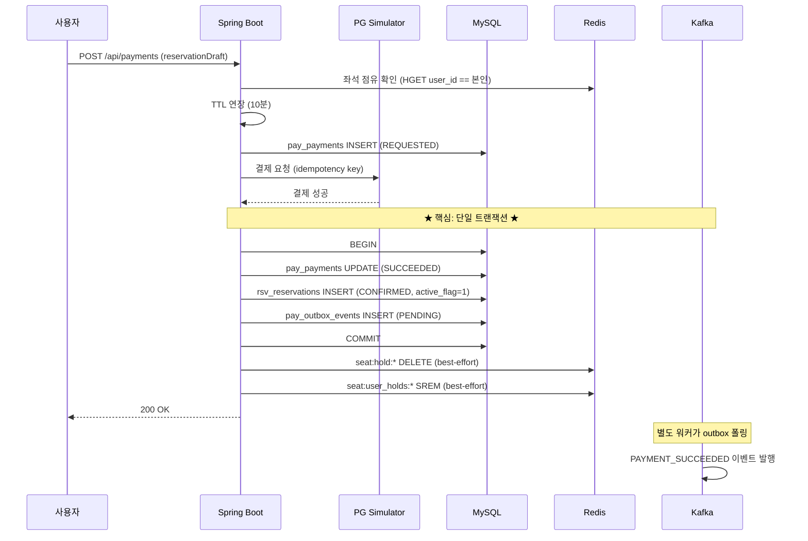

# Seat Hold 시스템 설계

> **문서 버전**: v0.1
> **작성일**: 2026-04-07
> **관련 문서**: PROJECT_PROPOSAL §8 도전 1, ERD §1.3 §3.4, WAITING_QUEUE_DESIGN §2.2

---

## 1. 무엇을 해결하려는가

오픈런 시점에 *동일 좌석*을 노리는 동시 요청이 수십~수백 건 발생한다. 시스템은 다음을 *정확히* 보장해야 한다:

1. **유일성** — 한 좌석은 *동시에 한 사람*에게만 점유된다 (중복 점유 0건).
2. **공정성** — 진입 토큰을 가진 사용자만 점유 시도할 수 있다 (대기열 우회 차단).
3. **제한성** — 한 사용자는 동시에 N개 이하의 좌석만 점유할 수 있다 (매크로 봇 차단).
4. **자동 해제** — 점유 후 7분 내 결제 안 하면 자동 반환된다.
5. **정합성** — 점유 → 결제 → 확정의 어느 단계가 실패해도 시스템 상태는 일관된다.

이 5가지를 *처리량을 유지하면서* 보장하는 것이 본 설계의 목표다. 대기열과 함께 PROJECT_PROPOSAL §8 도전 1과 도전 4(읽기·쓰기 비대칭)의 핵심이다.

---

## 2. 좌석 상태 모델

### 2.1 좌석의 3가지 상태

| 상태 | 정의 | 저장 위치 |
|---|---|---|
| **AVAILABLE** | 누구나 점유 가능 | (어디에도 기록 없음 — 기본 상태) |
| **HELD** | 누군가 임시 점유 중. TTL 7분. | Redis Hash |
| **CONFIRMED** | 결제 완료, 영구 할당 | MySQL `rsv_reservations` (active_flag=1) |

**핵심 사상:** 상태가 *어디에 기록되어 있는지로* 상태를 판단한다. 별도의 status 컬럼 없음.

- Redis에 키가 *있다* → HELD
- Redis에 키가 *없고* MySQL에 active 행이 *있다* → CONFIRMED
- 둘 다 *없다* → AVAILABLE

이 모델의 이점:
- 별도 상태 필드 동기화 없음 → 정합성 깨질 여지 적음
- 휘발 상태(HELD)와 영속 상태(CONFIRMED)의 *저장 매체가 분리*됨 → 각각에 최적

### 2.2 상태 전이도

```
                  point
                    │
                    │  hold (성공)
                    ▼
               ┌─────────┐
       ┌──────▶│  HELD   │──────┐
       │       └────┬────┘      │
       │            │           │
       │       confirm          │  TTL 만료 / 자진 해제
       │            │           │
       │            ▼           ▼
       │      ┌──────────┐  AVAILABLE
       │      │CONFIRMED │   (Redis 키 삭제)
       │      └────┬─────┘
       │           │
       │      cancel (보상)
       │           │
       └───────────┘
```

상태 전이는 4가지뿐이다. 의도적으로 단순화했다.

---

## 3. Redis 자료구조 설계

### 3.1 키 네이밍

```
seat:hold:{gameId}:{gameSeatId}        → Hash, TTL 420초 (7분)
seat:user_holds:{gameId}:{userId}      → Set, 사용자별 보유 좌석 목록 (제한 검증용)
```

### 3.2 각 키의 역할

#### `seat:hold:{gameId}:{gameSeatId}` (Hash, TTL 7분)

좌석의 *점유 상태 + 점유자 정보*. 키의 존재 자체가 "HELD"를 의미한다.

```
HSET seat:hold:42:12345
  user_id "100"
  held_at 1712486400000
  expires_at 1712486820000
  token "abc-def-123"
EXPIRE seat:hold:42:12345 420
```

**왜 String이 아니고 Hash인가:**
- String이면 점유자 ID만 저장 가능, 만료 시각·토큰 등 부가 정보 못 담음
- 디버깅 시 "이 좌석 누가 / 언제 잡았나" 즉시 확인 가능
- 타임아웃 처리 시 expires_at을 명시적으로 비교 가능 (TTL 보강)

**왜 expires_at을 또 저장하나 — TTL 있는데:**
TTL은 Redis가 자동 삭제해주지만, *만료 직전*에 race condition이 발생할 수 있다. 점유 만료 처리 워커나 좌석 조회 로직이 expires_at을 *명시적으로* 비교하면 더 안전하다. §6 시나리오 4 참조.

#### `seat:user_holds:{gameId}:{userId}` (Set)

한 사용자가 *현재 보유 중인 좌석 목록*. 동시 점유 좌석 수 제한 검증용.

```
SADD seat:user_holds:42:100 "12345"
SCARD seat:user_holds:42:100  → 1
```

**왜 별도 키인가:**
- 사용자 점유 수(누가, 언제, 어떤 토큰으로, 지금 몇 개째 클릭 중?)를 *조회 한 번*에 알아내야 하는데, 
    `seat:hold:*:*`를 SCAN하면 O(N)이라 느림
- Set으로 두면 SCARD가 O(1)
- 점유 해제 시 SREM도 O(1)

**TTL은 어떻게:**
- 이 Set 자체에는 TTL을 두지 *않는다*
- 대신 `seat:hold` 키가 만료되면, 좌석 점유 만료 처리에서 *명시적으로* SREM
- 또는 사용자가 새 좌석 점유 시도 시 *집합의 각 멤버를 검증*하여 stale 항목 정리

이 부분이 §6 시나리오 5(만료된 좌석이 user_holds에 남는 문제)의 해결책이다.

---

## 4. 점유 알고리즘


## 5. 해제 시나리오

### 5.1 자진 해제 (사용자가 좌석 선택 변경)

```
function releaseHold(gameId, gameSeatId, userId):
    holdKey = "seat:hold:" + gameId + ":" + gameSeatId

    # 본인 소유 검증 후 삭제 (Lua)
    deleted = redis.eval("""
        local owner = redis.call('HGET', KEYS[1], 'user_id')
        if owner == ARGV[1] then
            redis.call('DEL', KEYS[1])
            return 1
        else
            return 0
        end
    """, [holdKey], [userId])

    if deleted == 1:
        redis.SREM("seat:user_holds:" + gameId + ":" + userId, gameSeatId)
```

**소유 검증이 핵심.** 다른 사람의 점유를 멋대로 해제하지 못하게.

### 5.2 TTL 자동 만료

Redis가 자동으로 `seat:hold` 키를 삭제한다. 단, `seat:user_holds` Set에는 *유령 항목*이 남는다. 이건 다음 두 가지로 정리:

**방법 A — Lazy cleanup (채택):**
사용자가 새 좌석 점유 시 user_holds Set의 각 항목에 대해 `seat:hold` 키 존재 여부를 검증, 없는 것은 SREM. 점유 시도 시점에 자연스럽게 정리됨.

**방법 B — 별도 만료 워커 (검토 후 미채택):**
워커가 주기적으로 모든 user_holds Set을 스캔해서 정리. *비용이 크고* lazy cleanup으로 충분하므로 미채택.

### 5.3 결제 확정으로 인한 해제

결제가 성공해서 MySQL에 CONFIRMED로 기록된 후, Redis 점유 키를 삭제한다. 이게 가장 위험한 구간이라 §7에서 별도로 다룬다.

---

## 6. 공격 시나리오와 경계 케이스

### 시나리오 1: 동시 점유 — 100명이 같은 좌석을 동시에 노림

**해결:** Lua 스크립트의 EXISTS+HSET 원자성. 100건의 요청이 동시에 도착해도 
*정확히 1건만 success = 1*을 받고 나머지는 0을 받는다. Redis가 단일 스레드라는 본질이 보장한다.

**검증:** k6 부하 테스트로 100 동시 요청 후 *정확히 1건*만 200 OK, 99건은 409 Conflict.

---

### 시나리오 2: 진입 토큰 없이 직접 호출

**해결:** §4.1 의사 코드의 1단계. 토큰 키가 Redis에 없으면 401.

**한계:** 이 검증은 좌석 점유 API 시점이다. 대기열 우회는 못 하지만, 토큰 발급 후 *15분 동안*은 자유롭게 점유 시도 가능. 토큰을 캡처당하면 막을 수 없음 (대기열 설계 §5 시나리오 3 참조).

---

### 시나리오 3: 한 사람이 4개 넘는 좌석을 잡으려 함

**해결:** §4.1 2단계. SCARD로 현재 보유 수 확인 후 4 이상이면 거부.

**한계:** SCARD와 SADD 사이에 race가 있다. 동시에 5개 점유를 시도하면 모두 SCARD = 0을 받고 통과할 수 있음. 이를 막으려면:
- (A) 사용자별 락 (Redis 분산락) — 복잡도 증가
- (B) Lua 스크립트로 SCARD + EXISTS + HSET + SADD를 한 번에 — *채택 예정 (v0.2)* 
- (C) 1차 방어는 단순 SCARD, 2차 방어는 결제 확정 시점에 user_id별 active 예매 수 검증 — *현재 채택* 

면접에서 "race condition 있지 않나요?" 물으면 "1차는 SCARD로 막고, 2차는 Lua 스크립트화로 v0.2에서 보강 예정이며, 최종 방어는 결제 확정 단계의 검증"이라고 답할 수 있어야 함.

---

### 시나리오 4: TTL 만료 직전의 race

**상황:** 사용자 A가 좌석을 잡고 6분 59초가 지났다. 사용자 B가 좌석 조회 API를 호출하는 순간 A의 키가 만료되어 사라진다. B는 "AVAILABLE"로 보고 점유를 시도한다. 그 사이 A는 결제를 완료해서 MySQL에 CONFIRMED를 INSERT 한다. → B의 점유 성공 + A의 확정 성공 → 중복 발생.

**해결:** §4.1 3단계 — Redis 점유 *전에* MySQL CONFIRMED를 검증한다. 그리고 최종 방어선은 ERD §3.4의 `uk_active_seat` 유니크 인덱스 — DB가 INSERT 거부.

**핵심 원칙:** 분산 시스템에서 race를 *원천 차단*은 어렵다. 대신 **여러 층의 방어선**을 두고, 어느 하나가 뚫려도 다음이 막게 한다:

1. 1층: Redis 원자 점유 (Lua) → 99% 막음
2. 2층: MySQL CONFIRMED 사전 검증 → 99.9% 막음
3. 3층: MySQL 유니크 제약 → 100% 막음 (최후 보루)

**왜 1·2층이 있는데 3층까지 두는가:** 1·2층은 *처리량 최적화*용이다. 대부분의 경합을 빠르게 거른다. 3층은 *정합성 보장*용이다. 1·2층 다 뚫린 0.01%를 막는다. 둘이 하는 일이 다르다.

---

### 시나리오 5: user_holds Set의 유령 항목

**상황:** 사용자가 좌석을 4개 점유한 상태에서 5분 동안 아무것도 안 함. 그 사이 4개 다 TTL 만료. 그러나 `seat:user_holds:42:100` Set에는 4개 항목이 그대로 남음. 이 사용자는 SCARD 결과 4를 받아 *새 좌석 점유 불가* 상태가 됨.

**해결:** §5.2 lazy cleanup. 새 좌석 점유 시도 시점에 user_holds의 각 항목에 대해 `seat:hold` 키 존재 여부 검증, 없으면 SREM. 검증 비용은 최대 4건의 EXISTS 명령 → 무시 가능.

**구체 알고리즘:**
```
function getUserActiveHolds(gameId, userId):
    members = redis.SMEMBERS("seat:user_holds:" + gameId + ":" + userId)
    activeMembers = []
    for m in members:
        if redis.EXISTS("seat:hold:" + gameId + ":" + m):
            activeMembers.append(m)
        else:
            redis.SREM("seat:user_holds:" + gameId + ":" + userId, m)
    return activeMembers
```

이 함수가 §4.1 2단계의 SCARD를 대체한다. 약간 더 비싸지만 정확하다.

---

### 시나리오 6: Redis 점유 → MySQL 확정 사이에 Redis가 죽으면

**상황:** 결제 성공 → MySQL `rsv_reservations` INSERT 성공 → Redis `seat:hold` 키 DELETE 시도 → Redis 응답 없음.

**결과:** MySQL에는 확정 기록이 있는데 Redis에는 점유 키가 남아있음. 이 좌석은 다른 사용자에게 *영원히 점유 중*으로 보임. **유령 점유.**

**해결:**
- **단기 (TTL):** 어차피 7분 내 만료. 그 사이엔 그 사용자가 점유 중인 것처럼 보이지만 *결과적으론* 정리됨.
- **중기 (애플리케이션):** 좌석 조회 시 Redis HELD 상태인 좌석에 대해 *MySQL에 CONFIRMED가 있는지*를 추가 검증. 있으면 "이미 확정됨"으로 표시 + 백그라운드 작업으로 Redis 키 정리.
- **장기 (Outbox 활용):** 결제 확정 시 발행되는 OutboxEvent의 컨슈머가 Redis 정리를 수행. Outbox가 *최소 한 번* 전달을 보장하므로, Redis 정리가 결국 일어남.

**면접 답변 요점:** "결정론적으로 막진 못하지만, *결과적으로 일관*하다(eventually consistent). TTL과 백그라운드 정리로 자동 회복된다." 분산 시스템의 *현실적인* 답변이다.

---

### 시나리오 7: 결제 시도 중 좌석 점유가 만료되면

**상황:** 사용자가 좌석을 잡고 결제 페이지로 이동, 결제 6분 59초 시점에 PG 응답을 기다리는 중 TTL 만료.

**해결 방안 두 가지:**

**A. 결제 시작 시점에 TTL 연장 (채택 검토 중):**
결제 시작 API에서 `EXPIRE seat:hold:... 600` 으로 10분으로 연장. 단, *결제 시작 전 다른 사용자가 점유 시도해서는 안 됨* — 이건 어차피 Lua 스크립트가 막음.

**B. 결제 실패 시 명시적 좌석 회수 (보상):**
TTL 만료를 그대로 두고, 결제가 *너무 늦게* 성공하면 *PG 응답을 무시*하고 자동 환불 처리. 복잡함.

**현재 결정: A 채택.** 결제 시작 시점에 TTL 연장. 단, 연장은 1회만 허용 (결제 재시도 무한 연장 방지).

---

### 시나리오 8: 좌석 배치도 조회와 점유의 동시성

**상황:** 사용자가 좌석 배치도를 조회하는 순간, 다른 사용자가 어떤 좌석을 점유한다. 사용자는 *방금 점유된 좌석*을 AVAILABLE로 본다.

**해결:** *완벽히 막을 수 없다*. 이건 normal race이고, 사용자가 점유 시도 시 §4.1의 Lua 스크립트가 거절하면 그만이다.

**UX 보완:** 클라이언트는 좌석 배치도를 *주기적으로 갱신*(예: 5초)해서 최신 상태를 보여준다. 또는 SSE/WebSocket으로 실시간 갱신 (본 프로젝트 비목표).

---

## 7. 결제 확정과의 경계

여기가 *시스템 전체에서 가장 위험한 지점*이다. Redis 휘발 상태가 MySQL 영속 상태로 전이되는 순간.

### 7.1 확정 흐름



### 7.2 핵심 디테일

**Redis 정리는 best-effort다.** MySQL 트랜잭션 *밖에서* 수행한다. 실패해도 사용자 응답은 200으로 보낸다. 왜냐하면:

1. 사용자에게 중요한 사실은 "결제 성공 + 좌석 확정" → MySQL 트랜잭션이 끝난 시점에 이미 보장됨
2. Redis 키는 *어차피 TTL로 만료*됨 → 영구 손상 없음
3. Redis 정리 실패로 사용자 응답을 막으면 UX 최악

**MySQL 트랜잭션 안에 Outbox INSERT를 포함시키는 게 핵심.**
이게 PROJECT_PROPOSAL §8 도전 2(Transactional Outbox)의 본체다. 결제 + 예매 + 이벤트 발행 의도가 *한 트랜잭션*으로 묶여서 원자성이 보장된다. ERD §3.5의 `pay_outbox_events`가 이 역할.

**좌석 점유 검증은 결제 시작 시 1회.**
결제 진행 *중*에 좌석 점유가 만료되어도 이미 시작된 결제를 막진 않는다 (TTL 연장으로 보호). 정합성의 최후 보루는 §6 시나리오 4의 다층 방어다.

---

## 8. 부하 테스트 계획 (요약)

§8 도전 1의 검증을 위해 부하 테스트로 다음을 측정:

| 측정 항목 | 목표 |
|---|---|
| 동시 점유 시도 100건 → 성공 1건 + 실패 99건 (정확성) | 100% |
| 1만 좌석 × 100 동시 사용자 부하에서 처리량 | ≥ 500 req/s |
| 점유 API p99 응답시간 | ≤ 500ms |
| 30분 부하 후 user_holds Set의 stale 비율 | ≤ 5% |
| 동일 좌석 중복 확정 건수 | 0 |

**실험 비교 — 3가지 점유 방식:**

1. **MySQL 비관적 락** (`SELECT ... FOR UPDATE`)
2. **MySQL 낙관적 락** (version 컬럼)
3. **Redis 원자 점유 (Lua)** ← 본 설계 채택

세 방식의 처리량·응답시간·실패 패턴을 비교하는 게 학습 산출물이다. 결과는 ADR-0005(또는 그에 해당하는 ADR)로 박제.

---

## 9. 의도적으로 *하지 않은* 것

### 9.1 Redis 분산락 (Redlock 등)

분산 환경에서 *명시적 락*을 거는 방식. 본 설계는 *상태 자체를 원자적으로 점유*하는 방식이라 별도의 락이 필요 없다. Redlock은 디버깅 어렵고 운영 복잡도가 크다 — Martin Kleppmann의 ["How to do distributed locking"](https://martin.kleppmann.com/2016/02/08/how-to-do-distributed-locking.html)에서 지적된 함정들. 본 프로젝트의 도메인엔 더 단순한 도구로 충분.

### 9.2 좌석 추천 (연석 자동 찾기)

"2인 연석" 같은 조건으로 좌석을 *자동으로* 찾아주는 기능. 도메인적으로 흥미롭지만 *동시성 학습 목표와 무관*하고 알고리즘 복잡도가 본 설계의 핵심을 흐림. 비목표.

### 9.3 좌석 배치도 실시간 푸시

SSE/WebSocket으로 좌석 상태 변화를 실시간 푸시. UX는 좋지만 본 프로젝트는 폴링으로 단순화. 비목표.

### 9.4 부분 점유 / 좌석 등급 변경

점유 후 좌석 등급을 변경하거나 일부만 결제하는 등. 도메인 폭발. 비목표.

### 9.5 매크로 봇 차단의 정교한 알고리즘

본 설계는 *단순 동시 점유 수 제한 (4)* 만 적용. 캡차, 봇 탐지 등은 본 프로젝트 범위 외.

---

## 10. 향후 개선 (본 프로젝트 외)

면접 답변용으로 *알고는 있는 것*들:

- **Lua 스크립트로 SCARD+EXISTS+HSET+SADD 통합** (v0.2 예정 작업)
- **Redis Cluster** 로 고가용성 (HASH TAG로 같은 슬롯 보장 필요)
- **WebSocket 기반 좌석 상태 푸시**
- **Outbox 컨슈머가 Redis 정리까지 수행** (시나리오 6 완전 해결)
- **봇 탐지 / 캡차 / WAF**
- **좌석 추천 알고리즘**

---


## 부록 A. 변경 이력

| 버전 | 일자 | 변경 내용 |
|---|---|---|
| v0.1 | 2026-04-07 | 초안. 3-state 모델, Lua 기반 원자 점유, 8개 시나리오, 결제 확정 경계 정의. |