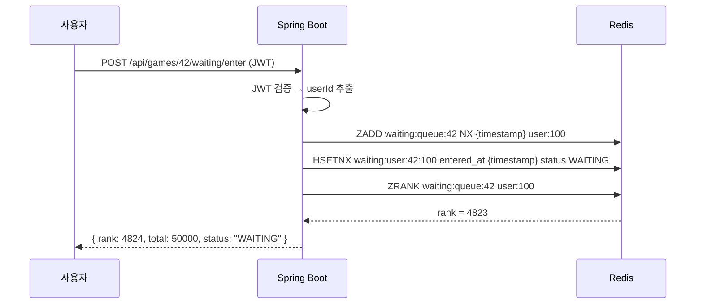
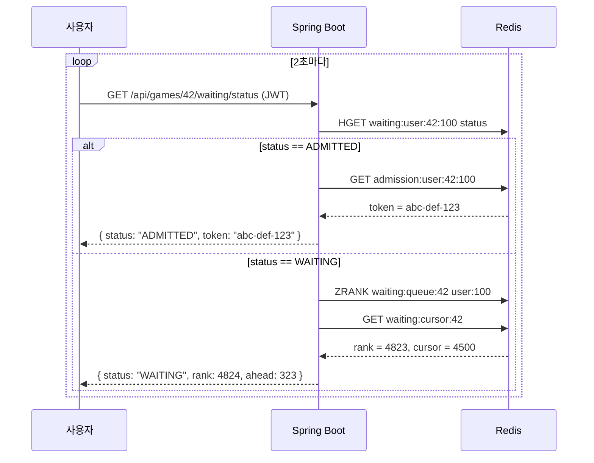
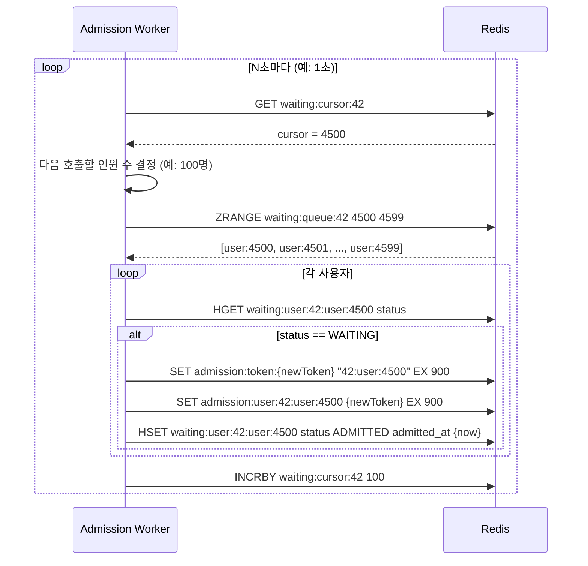
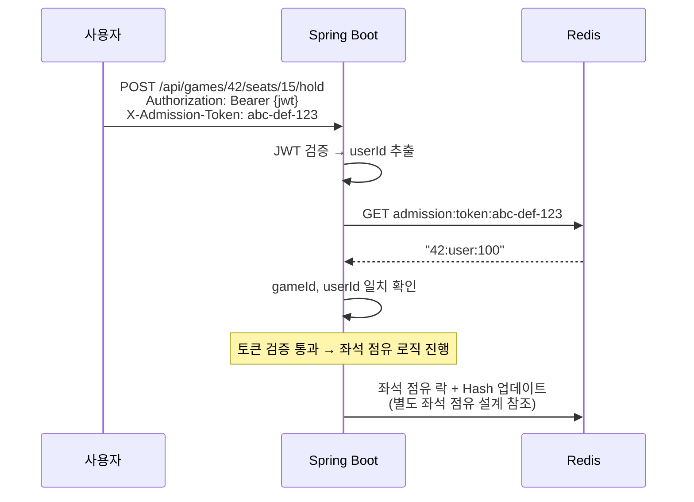

# Waiting Queue 시스템 설계

> **문서 버전**: v0.1
> **작성일**: 2026-04-14
> **관련 문서**: PROJECT_PROPOSAL §8 도전 3

---

## 1. 왜 대기열이 필요한가

본 프로젝트의 핵심 시나리오(PROJECT_PROPOSAL §4.2 Scenario B)는 *오픈런*이다. 한국시리즈 1차전 티켓 오픈 시점에 5만 명이 동시에 좌석 선택 페이지에 접근하면 다음 문제가 동시에 발생한다:

1. **애플리케이션 서버 폭주** — 5만 동시 접속이 좌석 점유 로직을 직접 때리면 락 경합으로 처리량 0에 수렴
2. **불공정** — 늦게 들어온 사람이 빠른 네트워크로 먼저 좌석 잡는 사태
3. **사용자 경험 최악** — 새로고침하면 매번 순번이 밀리는 *기존 티켓팅 사이트의 악명*

대기열은 이 세 문제를 동시에 푸는 도구다. **요청 자체를 슬로우다운하면서 공정한 순서를 부여**한다. 좌석 점유 시스템은 대기열을 통과한 *제한된 인원*만 처리하면 되므로 처리량이 안정화된다.
 
---

## 2. 핵심 개념 분리

### 2.1 두 가지 상태를 명확히 분리

| 상태 | 의미 | Redis 위치 |
|---|---|---|
| **대기 중 (Waiting)** | 줄 서있는 상태. 좌석 페이지 접근 *불가*. | Sorted Set + Hash |
| **입장 허가 (Admitted)** | 호출되어 토큰을 받은 상태. 좌석 페이지 접근 *가능*. | String (진입 토큰) |

**이 두 상태를 헷갈리면 안 된다.** 대기열은 *순번을 관리*하고, 진입 토큰은 *입장 허가를 증명*한다. 둘은 다른 자원이다.

### 2.2 진입 토큰의 역할

진입 토큰은 좌석 점유 API의 *필수 헤더*다. 토큰 없이는 좌석 페이지 API가 401을 던진다.

```
GET /api/games/{gameId}/seats        ← 토큰 필수
POST /api/games/{gameId}/seats/{seatId}/hold  ← 토큰 필수
```

이로써 *대기열을 우회한 직접 호출*이 원천 차단된다. URL을 알아도 토큰이 없으면 들어갈 수 없다.

### 2.3 토큰 ≠ JWT

진입 토큰은 인증 JWT와는 *다른 자원*이다.

| 구분 | JWT | 진입 토큰 |
|---|---|---|
| 발급자 | 인증 서버 | 대기열 워커 |
| 검증 방식 | 서명 검증 (stateless) | Redis 조회 (stateful) |
| 수명 | 24시간 | 15분 |
| 무효화 | 어려움 | Redis 삭제로 즉시 |
| 용도 | "이 사람이 누구인가" | "이 사람이 입장 허가를 받았는가" |

좌석 점유 API는 *둘 다* 검증한다: JWT로 사용자 식별, 진입 토큰으로 입장 자격 확인.
 
---

## 3. Redis 자료구조 설계

### 3.1 키 네이밍 컨벤션

```
waiting:queue:{gameId}            → Sorted Set
waiting:user:{gameId}:{userId}    → Hash
waiting:cursor:{gameId}           → String (counter)
admission:token:{token}           → String (TTL 15분)
admission:user:{gameId}:{userId}  → String (역참조, TTL 15분)
```

### 3.2 각 키의 역할

#### `waiting:queue:{gameId}` (Sorted Set)

대기열의 *순서*. score는 진입 timestamp(ms), member는 userId.

```
ZADD waiting:queue:42 NX 1712486400123 "user:100"
ZADD waiting:queue:42 NX 1712486400125 "user:101"
```

**`NX` (Not eXists) 옵션이 핵심.** 사용자가 새로고침해도 score가 *덮어쓰이지 않도록* 한다. 이게 빠지면 새로고침 시 순번이 뒤로 밀린다.

#### `waiting:user:{gameId}:{userId}` (Hash)

사용자의 메타데이터.

```
HSET waiting:user:42:100
  entered_at 1712486400123
  status "WAITING"
  admitted_at 0
```

`status` 값:
- `WAITING` — 대기 중
- `ADMITTED` — 호출되어 토큰 받음
- `EXPIRED` — 토큰 만료 (좌석 못 잡음)
- `CONSUMED` — 좌석 점유까지 완료

#### `waiting:cursor:{gameId}` (String)

*마지막으로 호출된 순번*. 워커가 이 값을 기준으로 다음 N명을 호출한다.

```
SET waiting:cursor:42 0    # 초기값
INCRBY waiting:cursor:42 100  # 100명 호출 후
```

#### `admission:token:{token}` (String, TTL 15분)

진입 토큰. 키는 토큰 자체(랜덤 UUID), 값은 `{gameId}:{userId}`.

```
SET admission:token:abc-def-123 "42:100" EX 900
```

좌석 점유 API는 헤더의 토큰으로 이 키를 조회한다. 존재하면 통과, 없으면 401.

#### `admission:user:{gameId}:{userId}` (String, TTL 15분)

위 토큰의 *역참조*. 한 사용자가 토큰 두 개 발급받지 못하게 + 사용자별 토큰 조회를 빠르게.

```
SET admission:user:42:100 "abc-def-123" EX 900
```
 
---

## 4. 핵심 흐름

### 4.1 대기열 진입



**핵심:**
- `ZADD ... NX`: 이미 진입한 사용자는 score 안 바뀜 → 새로고침 안전
- `HSETNX`: 같은 이유로 메타데이터도 안 덮어씀
- rank는 0-based이므로 사용자에게 보여줄 때는 +1

### 4.2 순번 조회 (사용자가 폴링)

사용자는 일정 주기(예: 2초)로 자기 순번을 조회한다.



**`ahead = rank - cursor`** 가 *내 앞에 남은 사람 수*다. 이게 진짜 의미 있는 숫자야 — 전체 rank보다 사용자가 보고 싶어하는 정보다.

### 4.3 워커가 호출 (입장 허가 발급)

별도 스케줄러(또는 Spring Boot 내부 스케줄링)가 일정 주기로 동작.



**호출 인원(N)을 어떻게 결정하나?** 좌석 점유 처리 능력에 따라 동적으로:
- 현재 활성 토큰 수가 임계치(예: 1000) 미만이면 100명 호출
- 임계치 이상이면 호출 보류

이것이 *백프레셔*다. 하류 시스템이 처리할 수 있는 만큼만 상류에서 흘려보낸다.

### 4.4 좌석 점유 API에서 토큰 검증



**핵심 검증 단계:**
1. JWT의 userId가 토큰의 userId와 일치하는가? (다른 사람 토큰 도용 방지)
2. URL의 gameId가 토큰의 gameId와 일치하는가? (다른 경기 토큰 사용 방지)
3. 토큰이 존재하는가? (없으면 만료 또는 우회 시도)

### 4.5 토큰 만료 시

토큰의 TTL이 자연스럽게 만료되면 Redis가 자동 삭제한다. 만료된 사용자는 다음 폴링 시 401을 받고, 클라이언트는 *대기열 재진입*을 안내받는다.

만료 시점에 별도의 정리 작업은 필요 없다. **TTL의 가장 큰 장점이 이것** — 만료 처리를 코드로 안 짜도 된다.
 
---

## 5. 공격 시나리오와 방어

> 이 섹션이 본 문서의 핵심이다.

### 시나리오 1: "새로고침으로 순번을 앞당길 수 있나요?"

**공격:** 사용자가 순번이 안 좋자 새로고침으로 새 진입 시각을 받으려 한다.

**방어:** `ZADD ... NX` + `HSETNX`. 이미 존재하는 키는 덮어쓰지 않는다. 새로고침 시 *기존 진입 시각이 유지*되므로 순번은 변하지 않는다.

**검증 방법:** 통합 테스트에서 같은 userId로 ZADD를 두 번 호출하고, score가 첫 호출의 값과 동일한지 검증.
 
---

### 시나리오 2: "대기열 우회로 좌석 페이지 직접 호출"

**공격:** URL을 알아내어 대기열 없이 `POST /api/games/42/seats/15/hold`를 호출한다.

**방어:** 좌석 점유 API는 `X-Admission-Token` 헤더를 *필수*로 받는다. Redis에 토큰 키가 없으면 401. 토큰은 워커만 발급할 수 있고, 워커는 cursor 기반으로만 호출하므로 우회 불가.

**검증 방법:** 대기열 진입 없이 좌석 API 호출 시 401 반환되는지 통합 테스트.
 
---

### 시나리오 3: "다른 사람 토큰 탈취"

**공격:** 어떻게든 다른 사용자의 진입 토큰을 알아내 자기 요청에 사용한다.

**방어:** 좌석 점유 API는 *JWT의 userId와 토큰이 매핑된 userId가 일치*하는지 검증한다. 다른 사람 토큰을 써도 JWT는 자기 것이므로 불일치 → 401.

**한계:** 만약 JWT까지 같이 탈취당했다면 막을 수 없다. 그건 본 시스템의 책임 영역 밖.
 
---

### 시나리오 4: "한 사람이 여러 탭을 열어 동시 진입 시도"

**공격:** 사용자가 5개 탭을 열어 5번 대기열 진입을 시도한다.

**방어:** `ZADD NX`로 *같은 userId는 한 번만 등록*된다. 5개 탭 모두 같은 순번을 받는다. 입장 후 토큰도 한 사용자당 1개만 발급된다.

**보너스:** 모든 탭에서 같은 토큰을 받게 되므로, 어느 탭에서 좌석을 잡든 동작한다. *사용자 친화적*이다.
 
---

### 시나리오 5: "토큰을 받았지만 7분 안에 결제 못 함"

**공격이라기보다 정상 경로:** 사용자가 좌석은 잡았는데 결제 페이지에서 시간 초과.

**방어:** 좌석 점유는 별도 TTL(7분)이 있고, 만료 시 좌석이 자동 반환된다. 진입 토큰의 TTL(15분)과 좌석 점유 TTL(7분)이 *분리*되어 있어 사용자는 토큰 유효 시간 안에 다른 좌석을 다시 시도할 수 있다.

**한계:** 토큰 TTL(15분) 자체가 만료되면 사용자는 대기열을 다시 타야 한다.
 
---

### 시나리오 6: "Redis가 죽으면?"

**공격이라기보다 장애:** Redis 노드가 응답하지 않는다.

**방어와 한계:**
- *현실*: 본 프로젝트의 Redis는 단일 인스턴스이므로, Redis 장애 = 대기열 시스템 전체 정지.
- *완화*: 토큰 검증 실패 시 좌석 점유는 *허용하지 않음* (안전 측 실패). 사용자에게 "일시 점검 중" 메시지.
- *데이터 손실 영향*: 대기열 데이터는 휘발성이므로 손실되어도 영구적 피해 없음. 사용자는 재진입.
- *복구 후*: 사용자들이 다시 대기열에 진입. 진입 시각이 새로 박히므로 *기존 순번 보존은 안 됨*. 이건 한계로 인정.

**프로덕션에서의 개선안 (본 프로젝트 범위 외):**
- Redis Sentinel 또는 Cluster로 고가용성
- 진입 시각을 *클라이언트에서 받아*(서버 시계 대신) 복구 후에도 유지하는 방식

 
---

### 시나리오 7: "대기열 진입 자체가 폭주 (DDoS)"

**공격:** 봇이 분당 수십만 요청으로 대기열 진입 API를 때린다.

**방어 (본 프로젝트 범위 내):**
- IP 기반 rate limiting (Spring Cloud Gateway 또는 Bucket4j)
- 동일 IP가 분당 10회 이상 진입 시도 시 차단
- 동일 userId는 어차피 1번만 등록되므로 *중복 등록*은 막힘 (DB 부하만 증가, 큐 무결성은 유지)

**방어의 한계:**
- 분산 봇넷은 IP 차단으로 못 막음
- 본 프로젝트는 WAF나 CDN 레벨 방어를 다루지 않음

**프로덕션 개선안:** AWS WAF, CloudFront, 또는 캡차.
 
---

### 시나리오 8: "FIFO가 정말 100% 보장되나?"

**진실:** 100%는 보장 못 한다.

- 같은 ms에 진입한 두 사용자의 score는 동일 → ZADD가 *어느 쪽을 먼저 처리할지* 결정
- 클라이언트의 네트워크 지연 차이로 server-side timestamp가 *클라이언트 진입 순서와 다를 수 있음*

**현실적 보장:** "진입 timestamp 단위 ms 정렬, 동일 ms 내 미세 역전 허용". PROJECT_PROPOSAL §6.2의 "FIFO 위반 5% 이내" 목표가 이 의미다.

"100% FIFO를 보장하려면 단일 노드의 단일 스레드여야 하는데, 그건 분산 환경의 본질과 충돌합니다. 충분히 공정한 정렬을 *통계적으로* 보장하는 것이 현실적입니다."
 
---

## 6. 부하 가정과 용량 계산

| 항목 | 값 |
|---|---|
| 최대 동시 대기 사용자 | 50,000 |
| 평균 대기열 진입 요청 (오픈 직후 1분) | 5,000 req/s |
| 워커 호출 주기 | 1초 |
| 호출 배치 크기 | 100명/배치 (조정 가능) |
| 활성 토큰 임계치 | 1,000 |
| 토큰 TTL | 15분 |
| 진입 timestamp 정밀도 | 1ms |

**Redis 메모리 추정:**
- Sorted Set 항목: ~80바이트/사용자 → 50,000명 × 80 = 4MB
- Hash 항목: ~120바이트/사용자 → 50,000명 × 120 = 6MB
- 토큰: ~80바이트/사용자 × 1,000 활성 = 80KB
- **합계: 약 10MB** (단일 경기 기준)

여러 경기 동시 운영 시에도 100MB 수준 → Redis 단일 인스턴스로 충분.
 
---

## 7. 의도적으로 *하지 않은* 것

### 7.1 우선순위 큐 (VIP 회원 등)

본 프로젝트는 단일 등급의 사용자만 다룬다. 우선순위 큐를 도입하면 score 산정 로직이 복잡해지고 학습 가치가 낮다. 비목표.

### 7.2 대기열 재정렬 (취소된 사용자 빈자리 메우기)

사용자가 대기 중 페이지를 닫아도 *순번은 그대로 둔다*. 워커가 호출 시 status가 WAITING이 아니면 건너뛴다 (cursor는 그래도 증가). 빈자리를 *재정렬*하지 않는 이유는, 재정렬이 race condition의 온상이고 학습 가치 대비 복잡도가 높기 때문이다.

### 7.3 예상 대기 시간 표시

"약 12분 남음" 같은 표시는 사용자 경험에 좋지만, 정확한 추정이 어렵고 본 프로젝트 핵심 가치와 무관하다. `ahead` 값(앞에 남은 사람 수)만 보여준다.

### 7.4 여러 Redis 인스턴스로의 샤딩

본 프로젝트는 단일 Redis. 경기별로 Redis를 샤딩하는 건 *프로덕션 개선안*으로만 언급한다.

### 7.5 SSE/WebSocket 푸시

순번이 호출되면 서버에서 클라이언트로 푸시하는 방식. 사용자 경험은 더 좋지만 본 프로젝트는 *폴링*으로 단순화. SSE 도입은 비목표.
 
---

## 8. API 명세 (요약)

상세는 별도 API 명세 문서에서. 여기서는 대기열 관련 엔드포인트만:

| 메서드 | 경로 | 인증 | 설명 |
|---|---|---|---|
| `POST` | `/api/games/{gameId}/waiting/enter` | JWT | 대기열 진입 |
| `GET` | `/api/games/{gameId}/waiting/status` | JWT | 내 순번/상태 조회 |
| `DELETE` | `/api/games/{gameId}/waiting/leave` | JWT | 대기열 자진 이탈 (선택적) |

좌석 점유 API는 별도. 이들은 `X-Admission-Token` 헤더를 필수로 요구한다.
 
---

## 9. 향후 개선 아이디어 (본 프로젝트 외)

면접 답변용으로 *알고는 있는 것*들. 본 프로젝트에선 안 만든다.

- **Redis Cluster** 로 고가용성
- **SSE/WebSocket** 으로 폴링 제거
- **클라이언트 timestamp 활용**으로 Redis 장애 복구 시 순번 보존
- **우선순위 큐** (VIP, 시즌권 회원)
- **예상 대기 시간** 추정 (이동 평균 기반)
- **WAF/캡차**로 봇 차단
- **경기별 Redis 샤딩**

---

## 부록 A. 변경 이력

| 버전 | 일자         | 변경 내용 |
|---|------------|---|
| v0.1 | 2026-04-14 | 초안. 5개 Redis 키 구조, 4개 핵심 흐름, 8개 공격 시나리오 정의. |
 